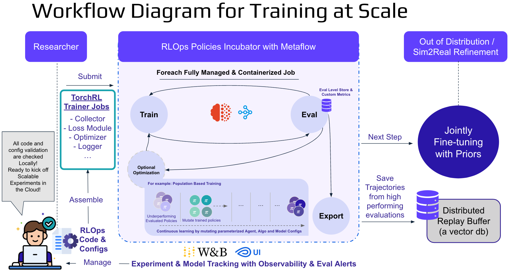
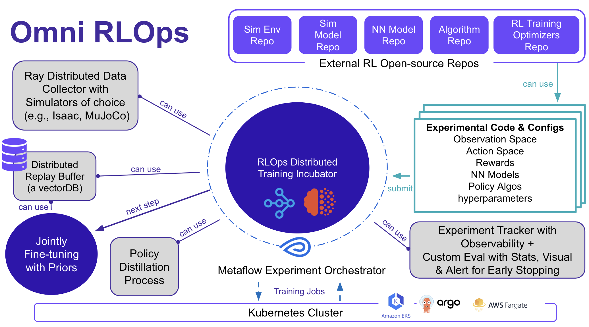

# RLOps Policies Incubator


**pi_incubator** is an unified RL training framework designed with RLOps in mind to empower researchers with a modular, scalable framework for training reinforcement learning (RL) policies. It integrates various tools such as TorchRL, Metaflow, and Ray to support both local development and cloud-based experiments (e.g., AWS EKS). This repository includes training scripts, configuration files, and utilities for orchestrating distributed RL experiments at scale, providing frictionless, scalable, and user-friendly infrastructure that accelerates research development cycles





---

## Table of Contents

- [Installation](#installation)
  - [Conda Environment Setup](#conda-environment-setup)
  - [Pip Dependencies](#pip-dependencies)
  - [Optional Dependencies](#optional-dependencies)
- [Usage](#usage)
  - [Running Locally](#running-locally)
  - [Running with `torchrun`](#running-with-torchrun)
  - [AWS & Kubernetes Configuration](#aws--kubernetes-configuration)
  - [Metaflow Runs](#metaflow-runs)
- [Additional Information](#additional-information)
- [TODO](#todo)

---

## High-Level Architecture Diagram



<details open>
<summary>Core Components</summary>
<br>

### External RL Open-Source Repos

- **Sim Env Zoo**: Collection of simulated training environments from various high fidelity simulators (MuJoCo, NVIDIA Isaac etc.)
- **Sim Model Zoo**: Reusable simulation/dynamics models and configurations from the shared simulators for standardized scenarios
- **NN Model Zoo**: Neural architectures tailored for RL (CNNs, RNN, Transformers, Mamba )
- **Policy Algorithm Zoo**: Range of RL algorithms (PPO, SAC, Dreamer, GRPO, etc.)

### Distributed Trainer (TorchRL)

- Leverages PyTorch and TorchRL for training with GPU acceleration

### Distributed Training Data Collection (Ray)

- Parallel rollout workers collecting experiences from high fidelity simulators
- Dynamically orchestrates resource allocation and training workflow using Ray and Ray Tune

### Distributed Replay Buffer (Ray + VectorDB)

- Stores large-scale offline and real-world gathered experience data
- Facilitates off-policy training, data re-sampling, and memory-based RL

### Experiment Orchestrator (Metaflow)

- Defines, executes, and tracks end-to-end training workflows (data prep, training, evaluation, deployment)
- Manages job submission to Kubernetes for auto-scaling

### Inference & Evaluation (Custom with Metaflow + Ray Tune + MLflow)

- Custom inference pipelines for batch evaluation with custom metrics
- Integrates with Ray Tune for hyperparameter tuning, metric aggregation and push to MLflow
- Automated alerts and early stopping to automatically halt underperforming experiments or trigger adjustments based on defined performance metrics.

### Experiment Tracking with Observability (MLflow)

- Stores artifacts (checkpoints, logs, metrics) for reproducibility and comparison
- Provides a dashboard for historical experiment insights

### Optional Policy Distillation Process

- Distills large policies into smaller, efficient models for real-world deployment

### Policy Exporter (Torch → ONNX)

- Converts PyTorch RL policies into ONNX format for edge deployment on embedded devices (Nvidia Jetson, etc.)

### Shared RL Training Optimizers Repos

- Training Optimization method like Population-Based Training (PBT), Auto-curriculum, Domain Randomization (DR), Unsupervised Environment Design (UED), Self-Play

### Custom Experiment Configurations

- User defined experiment configurations (YAML/JSON) handling: Training workflow, environment parameters, hyperparameters, compute resources, deployment settings, etc.
</details>


By leveraging TorchRL, Ray, and Metaflow, they jointly provide an end-to-end RLOps solution—from flexible algorithm design to scalable, reproducible production experiments.**

**[TorchRL](https://github.com/pytorch/rl)**  
- **PyTorch-first:** Leverages PyTorch’s flexibility for custom RL algorithms.  
- **Modularity:** Allows rapid prototyping with composable network components.

**[Ray & Ray Tune](https://github.com/ray-project/ray)**  
- **Scalable Rollouts:** Distributes high-fidelity simulation data collection seamlessly.  
- **Automated Tuning:** Integrates hyperparameter search with third-party logging (W&B, MLflow).  
- **Efficient Scaling:** Transitions effortlessly from local experiments to multi-node clusters.

**[Metaflow](https://github.com/Netflix/metaflow)**  
- **Orchestration:** Simplifies complex workflow management and experiment tracking.  
- **Kubernetes Ready:** Automates containerized training jobs for on-prem or cloud deployments.


---

## Installation

### Conda Environment Setup

Create and configure your Conda environment with the following commands:

```bash
conda create --name rlops_env python=3.11
conda install -y -c conda-forge glew
conda install -y -c anaconda mesa-libgl-cos6-x86_64
conda install -y -c menpo glfw3
conda env config vars set MUJOCO_GL=egl PYOPENGL_PLATFORM=egl
conda deactivate && conda activate rlops_env
```

### Pip Dependencies

Install the required Python packages using the provided `requirements.txt` file:

```bash
pip install -r requirements.txt
```


### Optional Dependencies

For additional functionality, install these optional packages:

```bash
pip install ray[default]==2.8.1
pip install onnx-pytorch
pip install onnxruntime
pip install metaflow-ray
```

---


## Usage

### Running Locally

To run a baseline training locally, use the following command:

```bash
python train_ppo.py --config configs/experiment_config_baseline.yaml
```

### Running with `torchrun`

For distributed training using `torchrun`, execute:

```bash
torchrun --nnodes=1 --nproc-per-node=1 --max-restarts=1 --rdzv-id=1 --rdzv-backend=c10d --rdzv-endpoint=localhost:0 train_ppo.py --config configs/experiment_config_baseline.yaml
```

Or to run a tuned configuration:

```bash
torchrun --nnodes=1 --nproc-per-node=1 --max-restarts=1 --rdzv-id=1 --rdzv-backend=c10d --rdzv-endpoint=localhost:0 train_ppo.py --config configs/experiment_config_tuned_PPO.yaml
```

### AWS & Kubernetes Configuration

- **Deploying to AWS with Kubernetes:**

As of now, please go `terraform-aws-metaflow` then follow the official [Outerbounds instruction](https://docs.outerbounds.com/engineering/deployment/aws-k8s/deployment/#apply-terraform-template-to-provision-aws-infrastructure) to deploy these services in your AWS account:AWS EKS cluster, Amazon S3, AWS Fargate and Relational Database Service (RDS). 


- **AWS EKS:**

  Update your kubeconfig for your EKS cluster:

  ```bash
  aws eks update-kubeconfig --name <cluster name>
  ```

- **AWS API Gateway:**

  Retrieve your API key value:

  ```bash
  aws apigateway get-api-key --api-key <YOUR_KEY_ID_FROM_CFN> --include-value | grep value
  ```

- **Metaflow AWS Configuration:**

  Configure Metaflow to use AWS:

  ```bash
  metaflow configure aws
  ```

### Metaflow Runs

Run your training flows on Kubernetes with Metaflow:

```bash
python torch_flow.py --no-pylint --environment=conda run --with kubernetes
```

Other experimental Metaflow runs:

```bash
python ppo_metaflow.py run
python ppo_metaflow.py run --with kubernetes
python ray_flow.py --no-pylint --environment=pypi run --with kubernetes
```

### Tracking Running Processes

If you're using Argo Workflows, you can track the running processes via port forwarding:

```bash
kubectl port-forward -n argo service/argo-argo-workflows-server 2746:2746
```

---

## Additional Information

- **Docker:**  
  Consider using a Dockerfile with a `requirements.txt` to containerize your environment. See the provided Dockerfile in the repository for reference.

- **Model Export:**  
  You can export trained Torch policies to ONNX for deployment on real-world systems.

- **Experiment Tracking:**  
  Integration with W&B and TensorBoard is supported for monitoring training progress.

---

## TODO

- [ ] Set up Training Dependencies with a Docker registry.
- [ ] Use W&B logger for improved experiment tracking.
- [ ] Experiment with Ray Tune on the TorchRL Trainer.
- [ ] Run Metaflow training comparisons.

---
